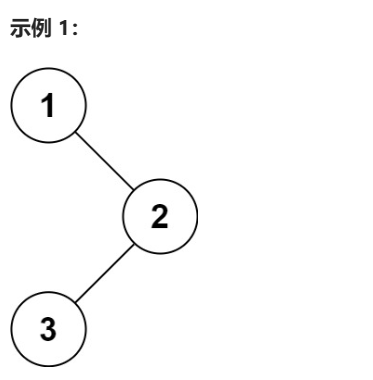

#题目原型
```
给定一个二叉树的根节点 root ，返回 它的 中序 遍历 。


示例 1：


输入：root = [1,null,2,3]
输出：[1,3,2]
示例 2：

输入：root = []
输出：[]
示例 3：

输入：root = [1]
输出：[1]
 

提示：

树中节点数目在范围 [0, 100] 内
-100 <= Node.val <= 100
```
示例 1：


# 代码呈现
```c
/**
 * Definition for a binary tree node.
 * struct TreeNode {
 *     int val;
 *     struct TreeNode *left;
 *     struct TreeNode *right;
 *
 */}

int * inorderTraversal(struct TreeNode* root , int * returnSize){
    struct TreeNode* stack[100]; // 使用指针数组作为栈  
    int top = -1;  
    *returnSize = 0;  
    int* ret = (int*)malloc(sizeof(int) * 100); // 动态分配存储结果的数组  
  
    while (root != NULL || top >= 0) {  
        while (root != NULL) {  
            top++;  
            stack[top] = root;  
            root = root->left;  
        }  
  
        root = stack[top];  
        top--;  
        ret[(*returnSize)++] = root->val;  
        root = root->right;  
    }  
  
    return ret;  
}
```
用一个 stack数组简单地代表了栈
用一个ret数组 来 保存 按照中序输出的数字
（不需要设置down，直接用一个top即可）
就这样
不拘泥于 书上的繁琐形式
