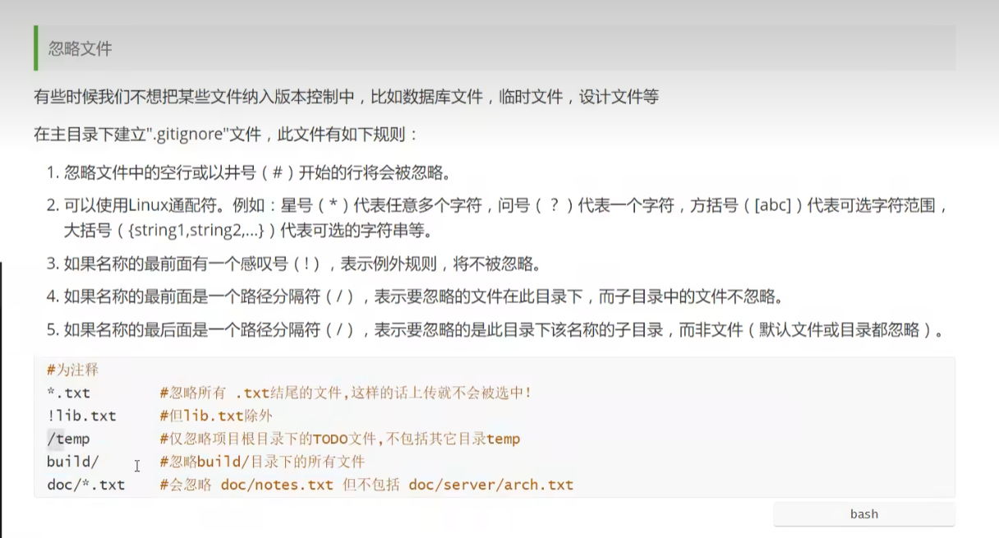

#简单操作
1. cd 改变目录
2. pwd 查询当前目录的地址
3. clear 清空
4. ls 显示该目录下的文件
5. touch 新建一个文件
6. rm 删除一个文件
7. mkdir 新建一个文件夹（目录） make directory
8. rm -r 删除文件夹（目录）remove
9. mv 移动文件 move
---
10. history 重新查看历史命令
11. help 帮助
12. exit 退出
---
---
#git 准备工作
git config -l 查看配置
   git config --global --list 用户配置（名字，邮箱） 
   git config --system --list 本地配置

    git config --global user.name "12345"
    git config --global user.email"59999888.com"

# git 操作
1.  git init
    git clone URL
2. git add .  全部添加到暂存区
   git add <文件名>
3. git commit -m "注释"   m->message
4. git push origin master
   如果 第一次没有设置origin 和 master
   则需要 
   1. git remote add origin URL
   2. git push -u origin master (第一次推送)  
   3. //使用 `-u` 选项的好处是，
   4. 在以后的推送操作中，可以简化命令，只需执行 `git push`，不需要后面的两个单词
5. git pull 如果你的仓库在网页中已经经过修改 ，而本地未修改，则需要git pull 再重新git add. .....

### 文件状态  

### 图片（便于理解）

